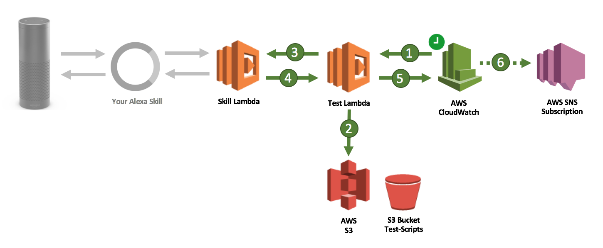

# Alexa Skills Kit Testing Framework
This framework lets you script and execute complex interactions with your Alexa skill 
in order to simulate a user's conversation. 

## How to use
### Unit & integration testing
If you built your skill with Java you can use this framework to write unit & integration
tests. The _AlexaUnitClient_ is leveraged to fire requests at your _RequestStreamHandler_ implementation
 class. The resulting _AlexaResponse_ object provides a lot of methods to validate your skill's response
 with making assertions. The fluent interface not only looks beautiful but is easy to understand
 and perfect to script your conversation without being too technical.

##### Code a skill conversation in Java
```java
@Test
public void doConversation() throws Exception {
    final AlexaClient client = AlexaUnitClient
        .create("applicationId", new MyRequestStreamHandler())
        .build();
        
    client.startSession() // SessionStartedRequest
        .launch() // LaunchRequest
            .assertThat(response -> response.getVersion().equals("1.0"))
            .assertTrue(AlexaAssertion.HasCardIsSimple)
            .assertExecutionTimeLessThan(1000)
            .done()
        .intent("myIntent", "slot1", true) // IntentRequest with custom intent
            .assertSessionStillOpen()
            .assertSessionStateEquals("slot1", "true")
            .assertMatches(AlexaAsset.OutputSpeechSsml, ".*hello.*")
            .done()
        .delay(1000)
        .repeat() // IntentRequest with builtin AMAZON.RepeatIntent
            .assertMatches(AlexaAsset.OutputSpeechSsml, ".*hello again.*")
            .done()
        .endSession(); // SessionEndedRequested
    }
```
The above unit tests fires five speechlet requests at your skill and validates
their outputs. 

##### Design a skill conversation in XML
Tired of coding tests? You can also script your conversation in XML and leverage
_AlexaLambdaScriptClient_ to execute it against your skill Lambda function.

```xml
<test>
    <configuration>
        <endpoint>myLambdaFunctionName</endpoint>
        <locale>de-DE</locale>
        <application id="myApplicationId" />
    </configuration>
    <sessions>
        <session>
            <launch>
                <assertTrue assertion="HasOutputSpeech" />
                <assertFalse assertion="HasOutputSpeechIsPlainText" />
                <assertEquals asset="StandardCardTitle" value="card_title" />
            </launch>
            <delay value="1000" />
            <intent name="intent1">
                <request>
                    <slots>
                        <slot key="slot1" value="val" />
                    </slots>
                </request>
                <assertSessionStateEquals key="slot1" value="val" />
            </intent>
            <yes>
                <assertMatches asset="OutputSpeechSsml" value=".*test.*" />
            </yes>
        </session>
        <session>
            <help>
                <assertTrue assertion="HasOutputSpeechIsSsml" />
            </help>
        </session>
    </sessions>
</test>
```
Have a look at a rich example file [here](/src/test/resources/script-max.xml) and use the 
[schema file](/src/main/resources/testScript.xsd) to script your own conversations.

To execute the XML script you need to do the following:

```java
public class MyTestLambdaFunction implements RequestStreamHandler {
    @Override
    public void handleRequest(InputStream inputStream, OutputStream outputStream, Context context) throws IOException {
        final AlexaLambdaScriptClient client = AlexaLambdaScriptClient
                        .create(URI.create("https://url.to/testscript.xml"))
                        .build();
        client.startScript();
    }
}
```

### Live testing
When your skill is in production it is even more important to know if everything
is doing fine. In case your skill runs in a Lambda function you are good to go with this 
framework to establish an early-warning-system for potential Alexa skill outages. 
Just think of a second Lambda function running the above code against your
live skill.

```java
public class MyTestLambdaFunction implements RequestStreamHandler {
    @Override
    public void handleRequest(InputStream inputStream, OutputStream outputStream, Context context) throws IOException {
        final AlexaClient client = AlexaLambdaClient
                .create("applicationId", "lambda-function-name") 
                .withLocale(Locale.US)
                .withUserId("myUserId")
                .build();
            // ...
    }
}
```

That Lambda function could be scheduled to run every x minutes. As all the
 _assert_-methods will throw runtime exceptions if the assertion is false that Lambda function
 would indicate suspicious moments with runtime errors.
 


1. A CloudWatch rule triggers a Lambda function that hosts the above test-code. This could be 
scheduled to every minute or just once a day.

2. The Lambda function would either execute the test-code directly or loads
 a test-script file (XML) stored in an S3 bucket or elsewhere. 
 
3. According to the test script the framework sends speechlet requests to the original skill
endpoint the same way Alexa service does on behalf of user requests from an Echo device. As the test
client manages session state multiple requests are covered under the hood of a single session. That's
how you could even simulate complex conversations between users and your skill. The skill Lambda function
won't recognize the difference unless you make use of an option to set a specific session attribute flag.

4. The skill Lambda function replies with a JSON speechlet response that is validated against certain 
expectations and assertions defined in your test-script. This would be the content of the reprompt, the 
existence of a card or the absence of a directive. You could even expect a maximum execution time. 
If only one of those assertions is wrong the test client throws a runtime validation exception causing the
Lambda function to return with a failure.

5. CloudWatch metrics keep track of all the invocation results. You can set an alarm if CloudWatch metrics
hit your custom-defined thresholds.

6. CloudWatch alarms can expose information to subscribers in SNS - possibly an email- or SMS-distribution-list.
This is how a test failure reaches you or your IT staff.

There you got your early-warning-system for Alexa skill outages.

## Dive deep

### AlexaClient 

As seen in above code snippets you always start with creating an instance of _AlexaClient_. Depending on your
use case you would decide for either _AlexaUnitClient_ (to test a Lambda _RequestStreamHandler_ in Java), an _AlexaLambdaClient_ 
(to test a remote Lambda function regardless of its source language) or _AlexaLambdaScriptClient_ (also tests a remote
Lambda function but it loads an XML test-script from a file stream).

```java
final AWSLambda lambdaClient = new AWSLambdaClient();
final AlexaClient client = AlexaLambdaClient
    .create("appId", "lambda-function-name")
        .withLambdaClient(lambdaClient)
        .withLocale(Locale.GERMANY)
        .withUserId("uid")
        .withAccessToken("accessToken")
        .withDebugFlagSessionAttribute("debug123flag")
    .build();
```

You have to give _AlexaClient_ the applicationId aka skillId as this one usually is validated in your
skill code and needs to be set properly. Secondly, you need to provide information about the test object. For
_AlexaLambdaClient_ and _AlexaLambdaScriptClient_ this is the Lambda function name, for _AlexaUnitClient_ it is an instance of _RequestStreamHandler_.
Optionally, you can assign the _AWSLambdaClient_ of AWS SDK to _AlexaLambdaClient_ that likely ships with
custom credentials or region settings of your choice. You can even mock that client before handing it in to _AlexaLambdaClient_.

Finally the client takes configuration values which go into Alexa speechlet requests (UserId, AccessToken, Locale). If you don't
set these values locale defaults to en-US, userId is generated and accessToken left empty. The _DebugFlagSessionAttribute_
optionally defines the name for a session attribute that goes into every request so skills are able to distinguish between
a test invocation and a user call.

### AlexaSessionActor

Every session in Alexa starts with the _SessionStartedRequest_. That why you initiate a new session
with the _startSession_-method of _AlexaClient_. It returns an instance of _AlexaSessionActor_ that got
all of the other methods you need to fire _LaunchRequests_ and _IntentRequests_.
 
```java
final AlexaSessionActor actor = client.startSession();
```
_AlexaSessionActor_ has methods for each request-type and builtin-intent type. None of them expect
 any arguments except for the _intent_-method that takes slots and a name for custom intents. Let's
 say we start with a _LaunchRequest_. 

```java
final AlexaResponse response = actor.launch();
```

### AlexaResponse

All these actor-methods return an _AlexaResponse_ instance which not only holds the actual response envelope
of your skill but provides a bunch of _assert_-methods you can use to validate the response. You can
define expectations for all kinds of speechlet-assets like output-speech, reprompts, cards and directives ...

```java
response.assertExists(AlexaAsset.RepromptSpeechSsml);
response.assertEquals(AlexaAsset.DirectivePlayAudioItemStreamOffset, "1000");
response.assertMatches(AlexaAsset.SimpleCardTitle, ".*title.*");
```
 
or you can ask for an assertion to be true or false:

```java
response.assertTrue(AlexaAssertion.HasCardIsStandard);
response.assertFalse(AlexaAssertion.SessionEnded);
```

or you can directly access the response envelope and form your own predicate:

```java
response.assertThat(speechletResponseEnvelope -> speechletResponseEnvelope.getVersion().startsWith("1"));
```

There are dedicated _assert_-methods for session attribute validation:

```java
response.assertSessionStateExists("sessionKey1");
response.assertSessionStateNotNull("sessionKey1");
response.assertSessionStateNotBlank("sessionKey1");
response.assertSessionStateEquals("sessionKey1", "expectedValue");
response.assertSessionStateContains("sessionKey1", "pectedVa");
response.assertSessionStateMatches("sessionKey1", "expected.[5]");
```

Last but not least there is an option to set a threshold for the execution time:

```java
response.assertExecutionTimeLessThan(2500);
```

_Assert_-methods throw runtime exceptions in case the made assertion is not true. If you want
to validate contents of the response without causing exceptions you can make use of another set of
methods provided by the response-object. Every _assert_-method has an equivalent method whose
return value is a Boolean. Now you are able to have dynamic conversation paths and make decisions based
 on skill responses.
 
```java
final AlexaResponse response2 = actor.intent("myIntent", "mySlot", "mySlotValue");
if (response2.equals(AlexaAsset.OutputSpeechPlainText, "Hi")) {
    final AlexaResponse response3 = actor.help();
}
```

### The fluent interface

Finally you should learn about the _done_-method you will use if you are a fan of fluent interfaces. _done_
is called to simply get back the _AlexaSessionActor_ for another request. 
 
```java
client.startSession() // SessionStartedRequest
    .launch() // LaunchRequest
        .assertThat(response -> response.getVersion().equals("1.0"))
        .assertTrue(AlexaAssertion.HasCardIsSimple)
        .assertExecutionTimeLessThan(1000)
        .done()
    .intent("myIntent", "slot1", true) // IntentRequest with custom intent
        .assertSessionStillOpen()
        .assertSessionStateEquals("slot1", "true")
        .assertMatches(AlexaAsset.OutputSpeechSsml, ".*hello.*")
        .done()
    .delay(1000)
    .repeat() // IntentRequest with builtin AMAZON.RepeatIntent
        .assertMatches(AlexaAsset.OutputSpeechSsml, ".*hello again.*")
        .done()
    .endSession(); // SessionEndedRequested
}
```

The _delay_-method adds a pause between two requests - useful if your skill has time-dependant features.
_endSession_ causes the session-closed event sent to your skill.

In a fancy one-liner you can simulate a whole conversation a user might have:

```java
actor.launch().done().help().done().intent("myIntent").done().yes().done().endSession();
```

### The log output

To dig into test results and investigate potential errors this test framework
writes logs that are easy to read. Here's an example:

```text
[START] session start request with sessionId 'SessionId.407cd45c-f8e5-4d24-a1d7-cc6c35ac12c8' ...
→ [INFO] Invoke lambda function 'lambda-function-name'.
→ [INFO] with request payload '{"version":"1.0","session":{"new":true,"sessionId":"SessionId.407cd45c-f8e5-4d24-a1d7-cc6c35ac12c8","application":{"applicationId":"amzn1.ask.skill.58bf9816-8b82-4a61-ae6b-0702f51c8751"},"attributes":{"myDebugFlag":true},"user":{"userId":"amzn1.ask.account.EBTK1BQLMLUTFETLPAFEY6PRIKISO0SXF72CA5ERS0JXUNLM3CHIJCNE6HNMJH4Y5DKDLGYKKHYI79KCTXZ9HK7X98ZSNVBLWDIMTHWK9TXRVVWJOKFG4UL49XZWA8LAIS3SCSYATLQO2OR6JZIWHCP5RDZAHBUL67WZZRFFAOXZBERULGGBLEIGRT2VVUWFNQJOQ2HTHMBJQPP"}},"context":null,"request":{"type":"SessionStartedRequest","requestId":"EdwRequestId.e59f22f6-cd70-4a92-868c-911fe9f94815","timestamp":"2016-12-29T22:30:14Z","locale":"en-US"}}'.
[DONE] session start request.

[START] launch request ...
→ [INFO] Invoke lambda function 'lambda-function-name'.
→ [INFO] with request payload '{"version":"1.0","session":{"new":false,"sessionId":"SessionId.407cd45c-f8e5-4d24-a1d7-cc6c35ac12c8","application":{"applicationId":"amzn1.ask.skill.58bf9816-8b82-4a61-ae6b-0702f51c8751"},"attributes":{"myDebugFlag":true},"user":{"userId":"amzn1.ask.account.EBTK1BQLMLUTFETLPAFEY6PRIKISO0SXF72CA5ERS0JXUNLM3CHIJCNE6HNMJH4Y5DKDLGYKKHYI79KCTXZ9HK7X98ZSNVBLWDIMTHWK9TXRVVWJOKFG4UL49XZWA8LAIS3SCSYATLQO2OR6JZIWHCP5RDZAHBUL67WZZRFFAOXZBERULGGBLEIGRT2VVUWFNQJOQ2HTHMBJQPP"}},"context":null,"request":{"type":"LaunchRequest","requestId":"EdwRequestId.4eb760c0-51cd-4c9b-9421-92455c7d465a","timestamp":"2016-12-29T22:30:15Z","locale":"en-US"}}'.
[DONE] launch request in 24 ms.
→ [PASSED] SessionStillOpen is TRUE.
→ [PASSED] Session state with key 'myDebugFlag' exists.
→ [PASSED] HasCard is TRUE.
→ [PASSED] Execution is not longer than 1000 ms.

[START] intent request 'myIntent' ...
→ [INFO] Invoke lambda function 'lambda-function-name'.
→ [INFO] with request payload '{"version":"1.0","session":{"new":false,"sessionId":"SessionId.407cd45c-f8e5-4d24-a1d7-cc6c35ac12c8","application":{"applicationId":"amzn1.ask.skill.58bf9816-8b82-4a61-ae6b-0702f51c8751"},"attributes":{"myDebugFlag":true,"intent":"launch"},"user":{"userId":"amzn1.ask.account.EBTK1BQLMLUTFETLPAFEY6PRIKISO0SXF72CA5ERS0JXUNLM3CHIJCNE6HNMJH4Y5DKDLGYKKHYI79KCTXZ9HK7X98ZSNVBLWDIMTHWK9TXRVVWJOKFG4UL49XZWA8LAIS3SCSYATLQO2OR6JZIWHCP5RDZAHBUL67WZZRFFAOXZBERULGGBLEIGRT2VVUWFNQJOQ2HTHMBJQPP"}},"context":null,"request":{"type":"IntentRequest","requestId":"EdwRequestId.05d529cb-c291-4ec8-9970-bc14b2c50603","timestamp":"2016-12-29T22:30:15Z","locale":"en-US","intent":{"name":"myIntent","slots":{"slot1":{"name":"slot1","value":"true"}}}}}'.
[DONE] intent request 'myIntent' in 15 ms.
→ [PASSED] SessionStillOpen is TRUE.
→ [PASSED] Session state with key 'slot1' is equal to 'true'.
→ [PASSED] Session state with key 'intent' is equal to 'myIntent'.
→ [PASSED] OutputSpeechSsml matches pattern '.*test.*'.

[START] wait for 1000 ms.
[DONE] wait for 1000 ms.

[START] intent request 'AMAZON.RepeatIntent' ...
→ [INFO] Invoke lambda function 'lambda-function-name'.
→ [INFO] with request payload '{"version":"1.0","session":{"new":false,"sessionId":"SessionId.407cd45c-f8e5-4d24-a1d7-cc6c35ac12c8","application":{"applicationId":"amzn1.ask.skill.58bf9816-8b82-4a61-ae6b-0702f51c8751"},"attributes":{"myDebugFlag":true,"intent":"myIntent3","slot1":{"name":"slot1","value":"true"},"slot2":{"name":"slot2","value":"321"}},"user":{"userId":"amzn1.ask.account.EBTK1BQLMLUTFETLPAFEY6PRIKISO0SXF72CA5ERS0JXUNLM3CHIJCNE6HNMJH4Y5DKDLGYKKHYI79KCTXZ9HK7X98ZSNVBLWDIMTHWK9TXRVVWJOKFG4UL49XZWA8LAIS3SCSYATLQO2OR6JZIWHCP5RDZAHBUL67WZZRFFAOXZBERULGGBLEIGRT2VVUWFNQJOQ2HTHMBJQPP"}},"context":null,"request":{"type":"IntentRequest","requestId":"EdwRequestId.c34dc76c-2ac4-4638-95e2-60d5b88d8c33","timestamp":"2016-12-29T22:30:16Z","locale":"en-US","intent":{"name":"AMAZON.RepeatIntent"}}}'.
[DONE] intent request 'AMAZON.RepeatIntent' in 3 ms.
→ [PASSED] Custom predicate matches.
→ [PASSED] StandardCardLargeImageUrl is NOT equal to 'https://img/small.jpg'.
→ [PASSED] StandardCardLargeImageUrl is equal to 'https://img/large.jpg'.
→ [PASSED] Session state with key 'myDebugFlag' exists.

[START] request session end with reason 'USER_INITIATED'.
→ [INFO] Invoke lambda function 'lambda-function-name'.
→ [INFO] with request payload '{"version":"1.0","session":{"new":false,"sessionId":"SessionId.407cd45c-f8e5-4d24-a1d7-cc6c35ac12c8","application":{"applicationId":"amzn1.ask.skill.58bf9816-8b82-4a61-ae6b-0702f51c8751"},"attributes":{"myDebugFlag":true,"intent":"AMAZON.RepeatIntent","slot1":{"name":"slot1","value":"true"},"slot2":{"name":"slot2","value":"321"}},"user":{"userId":"amzn1.ask.account.EBTK1BQLMLUTFETLPAFEY6PRIKISO0SXF72CA5ERS0JXUNLM3CHIJCNE6HNMJH4Y5DKDLGYKKHYI79KCTXZ9HK7X98ZSNVBLWDIMTHWK9TXRVVWJOKFG4UL49XZWA8LAIS3SCSYATLQO2OR6JZIWHCP5RDZAHBUL67WZZRFFAOXZBERULGGBLEIGRT2VVUWFNQJOQ2HTHMBJQPP"}},"context":null,"request":{"type":"SessionEndedRequest","requestId":"EdwRequestId.a064b024-7f74-4535-8452-7e34d5d9f418","timestamp":"2016-12-29T22:30:16Z","locale":"en-US","reason":"USER_INITIATED","error":null}}'.
[DONE] request session end with reason 'USER_INITIATED'.```