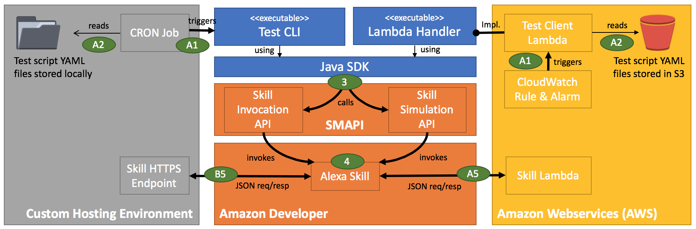
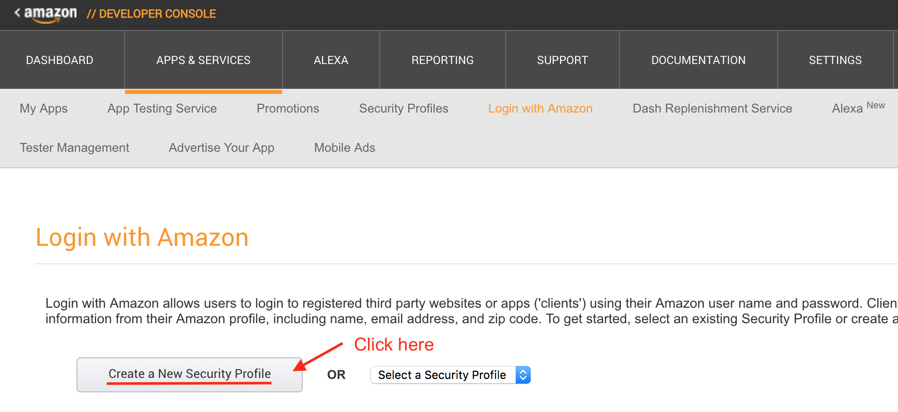
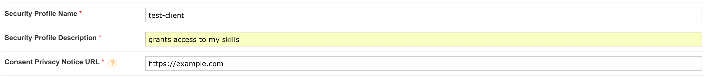

[](https://gitter.im/alexa-skills-kit-tester-java/Lobby?utm_source=badge&utm_medium=badge&utm_campaign=pr-badge&utm_content=badge)
[](http://search.maven.org/#artifactdetails%7Cio.klerch%7Calexa-skills-kit-tester-java%7C0.1.0%7Cjar)


# Alexa Skills Kit Testing Framework

This framework lets you script and execute complex conversations with your Alexa skills. Conversations
are specified in YAML format. The SDK uses _Skill Invocation API_ and _Skill Simulation API_ of the
Amazon's _Skill Management API (SMAPI)_ to fire requests at your skill endpoint and evaluate its responses
with help of assertions specified in YAML.

### Components



The SDK consists of three main components. Each of them can be used on its own and is dedicated to one specific use case.

__Java SDK__ is the core component which is encapsulating the access to the Test APIs as part of SMAPI. Neither your skill
needs to be written in Java nor do you need to write a single line of Java to leverage the Test SDK. But if you have a
skill implemented in Java you could use the core Java SDK to write unit tests. It got a nice and fluent object model.

__Test CLI__ sits on top of the Java SDK. As it comes as a JAR package it will be invoked from the commandline. The CLI
takes YAML files from local storage that specify the conversation you'd like to run against your skill endpoint.

__Lambda Handler__ also sits on top of the Java SDK. It implements a _LambdaRequestHandler_. The JAR package can be uploaded
to a Lambda function. The Lambda Handler consumes YAML script files from S3 buckets whose name is defined in environment variables.
To make things easier for you, this repository provides a CloudFormation template so everything (Lambda and S3 bucket) is set up for you.

### YAML scripts

YAML files will be created to specify multi-step and even multi-path conversations with you skill. As the test client
keeps track of session state multiple requests always belong to one an the same session.

```yaml
configuration:
  endpoint:
    type:     InvocationApi
    skillId:  # <<enter your skill-id>>
    region:   NA 
    locale:   en-US

StopIt: &Exit
  - intent: AMAZON.StopIntent
  - response.shouldEndSession == true

GuessFour: &GuessFour
  - intent: GuessNumber
  - number: 4
  - response.outputSpeech.ssml =~ /.*Great. That’s it.*/i : *Exit

GuessSix: &GuessSix
  - intent: GuessNumber
  - number: 6
  - response.outputSpeech.ssml =~ /.*Great. That’s it.*/i : *Exit

GuessFive: &GuessFive
  - intent: GuessNumber
  - number: 5
  - response.shouldEndSession == false
  - response.outputSpeech.ssml =~ /.*My number is higher.*/i : *GuessSix
  - response.outputSpeech.ssml =~ /.*My number is lower.*/i : *GuessFour
  - response.outputSpeech.ssml =~ /.*Great. That’s it.*/i : *Exit

Launch:
  - response.shouldEndSession == false
  - *GuessFive

```

Please note: as YAML anchors are used, the logical structure of this file is upside down (anchors can 
only be referenced AFTER they have been defined). Read it
from bottom to top.

This is a typical YAML conversation script which covers most of the supported concepts:
- __Launch__: This node is mandatory. The client uses this as an entry point. It implicitly fires a _LaunchRequest_
at your skill unless you're providing an _intent_ or _utterance_ child attribute (which in this case would open up the skill session 
with a one-shot rather than a _LaunchRequest_).

- __Assertions__: Assertions are expressed in simplified [JSONPath](http://goessner.net/articles/JsonPath/). A few examples:

```yaml
  - response.shouldEndSession == false  # session left open
  - response.reprompt.outputSpeech.text  # reprompt speech exists
  - response.outputSpeech.ssml =~ /.*test.*/i  # outspeech contains 'test'
  - sessionAttributes.key >= 10  # a session attribute named key as a value >= 10
```

You validate a JSON response coming from your skill against an expected output. See [JSON schema reference](https://developer.amazon.com/docs/custom-skills/request-and-response-json-reference.html#response-body-syntax)
for custom skills in Alexa.

In the above example the expectation for a response returned from the _LaunchRequest_
is that the session is left open by the skill. If an assertion is not met, the
test client throws an exception resulting in termination of the whole test execution. 

- __Gotos__: You can reference another YAML node in the script you'd like to 
follow up with (e.g. _*GuessFive_). In the above example we continue with the _GuessFive_ conversation step. 
Learn more about [YAML anchors](http://blog.daemonl.com/2016/02/yaml.html)

- __Conditional Paths__: A condition is similar to an assertion with one important difference. It has
a value assigned normally containing a Goto (YAML anchor reference). Assigning a value to an assertion
automatically turns this assertion into a condition. The condition won't raise an exception in case
the expression isn't true. But if the condition is met the test client will continue with the
conversation step referenced as a value to this condition. This is how you create multi-path
conversations. The test client dynamically follows a path and is dependant on the skill's response.

- __Conversation Steps__ always represent a call to your skill. It usually consists of the following:
    *  an anchor definition defined as a value to this node as otherwise you won't be able to enter it (with a Goto).
The _Launch_ node is the only kind of conversation step that doesn't need it as it automatically is the entry point.
    *  either an _intent_ or _utterance_ attribute. The _intent_ node contains the name of the intent you'd like to
fire at your skill whereas the _utterance_ attribute would contain the spoken text used to call your skill.
The _intent_ node will be taken in case you configured your script to access _InvocationApi_. _utterance_ definitions
only make sense and are supported when working with the _SimulationApi_. The API the test client will access 
is set in the _configuration_ section of the YAML file.
    * zero to many slot value assignments. In case you are firing an _intent_ at your skill you can optionally give it some
slot values. The attribute key needs to be the name of the slot in your skill.
    * zero to many of the above-mentioned _assertions_ expressed in JSONPath
    * zero to many of the above-mentioned _conditional paths_ expressed in JSONPath and assigned with a _Goto_ (conversation step) reference
to follow up with in case the expression is true.
    * zero to many _Gotos_ to follow up with in any case - without making these step(s) dependant on a validation expression. You
see such a _Goto_ in the _Launch_ node in the above example.

    It's worth to mention that the order in which you define each of these sub-elements only matters if
they are within the same category type (e.g. assertions and conditional paths will be processed top down). 
Otherwise, the test client will bring it in the following order, processing them one by one:

    1) It first looks for an _intent_ or _utterance_ element to set the type of request fired at your skill

    2) It then looks for slot value assignments it will only consider if it's working with _InvocationApi_ of course.

    3) Next, it processes the assertions in the order they are defined and applies it to the response returned from the skill.

    4) Next, it processes the conversational paths in order they are defined. More than one paths can be entered if
the skill response match more than just one condition.

    5) Lastly, the test client follow any _Gotos_ in the order they are defined. 


## Get started

In order to get started the Test clients needs access to your skill. It is using the _Login With Amazon_ SSO _client Id_ and _client secret_ of a _Security profile_ you
have to set up in the Amazon developer console + the refresh token of that profile given the proper rights to access skills for testing.
Learn how to set it up and get _client id_, _client secret_ and _refresh token_ at the very bottom of this README. 

## Run it

The YAML converation scripts can be executed from commandline (by using the Test CLI provided in this SDK) or in Lambda (by using the Lambda handler as part of this SDK).

### Test CLI

The CLI component expects an _lwaClientId_, _lwaClientSecret_ and _lwaRefreshToken_ as environment variables set up in the runtime environment. Learn
how to get these values in the _Getting started_ section.

```bash
$ export lwaClientId=...
$ export lwaClientSecret=...
$ export lwaRefreshToken=...
```
Now you can use the JAR package you get when you built the project and pass in the YAML script as a path reference.

```bash
$ java -jar test-client.jar -f ./path/to/your/script.yml
```

### Lambda Handler

Use the provided [CloudFormation template](assets/aws-cf-stack.json) and create a stack from it in AWS CloudFormation. During set up the template asks you for the
_Login With Amazon_ client id, client secret and refresh token. They all will be set as environment variables in the Lambda function.
The templates also creates a new S3 bucket from which the Lambda function running the test client will get the YAML scripts.

After the CloudFormation stack was successfully created, go to the newly created S3 bucket and upload one to many YAML scripts. Next,
you can run the Lambda function and see the results in the log output of it. Please note, that the test client will pick all *.yml files
it finds in the S3 bucket. This might lead to long running executions. The Lambda function by default is set to the maximum runtime of 300 seconds.

As the test client (and with it the Lambda execution) will terminate and raise an exception on missed assertions defined in the YAML scripts,
you could set up CloudWatch to catch those failures and send out an alarm. Think of the following scenario:


Create a CloudWatch rule that triggers the test Lambda function for periodical executions. Create a CloudWatch Alarm to triggers on
failed Lambda executions. Do this with your live skill and your test client will simulate entire conversations with your skill every X minutes
and sends out a notification via e-mail or SMS if your skill returns with unexpected responses.
What you will get is an early warning system and proactive monitoring for your Alexa skills in production.

### Java SDK

Just in case your skill is implemented in Java you can use the core Java component of this SDK to write unit tests. Even if you would
like to customize the test execution flow a bit more and you don't want to rely on YAML scripts, this might be useful for you.

#### Choose an Endpoint type
Your test-environment needs an endpoint configuration in order to tell it how you would like to address your skill. You can choose from:
__AlexaLambdaEndpoint__: Fires a sequence of request payloads at the Lambda-function which is your skill-endpoint. It communicates via AWS-API and needs your 
AWS credentials set in your environment. 

```java
AlexaEndpoint lambdaEndpoint = AlexaLambdaEndpoint.create("lamdaFunctionName").build();
```

The Lambda function is referenced by name and must exist in the AWS account whose credentials you set up in the execution environment (most likely from system properties,
, the _~/.aws/_-folder or - in case you're running your test-client in another Lambda-function - from the IAM execution role)

__AlexaInvocationApiEndpoint__: Fires a sequence of request payloads at your skill via Invocation API which is part of the Skill Management API (SMAPI). It needs
access to your developer account. You need to set the _lwaClientId_, _lwaClientSecret_ and _lwaRefreshToken_ as environment variables or pass it in to the builder.

```java
final AlexaEndpoint endpoint = AlexaInvocationApiEndpoint.create("skillId")
                .withEndpointRegion("NA")
                .withLwaClientId("yourClientId")
                .withLwaClientSecret("yourClientSecret")
                .withLwaRefreshToken("yourRefreshToken")
                .build();
```

The endpoint region is is either "NA" (North America) or "EU" (Europe). If you don't provide it the endpoint region defaults to NA.

__AlexaSimulationApiEndpoint__: Fires a sequence of utterances at your skill via Simulation API which is part of the Skill Management API (SMAPI). It needs
access to your developer account. You need to set the _lwaClientId_, _lwaClientSecret_ and _lwaRefreshToken_ as environment variables or pass it in to the builder.

```java
final AlexaEndpoint endpoint = AlexaSimulationApiEndpoint.create("skillId")
                .withLocale(Locale.US)
                .withLwaClientId("yourClientId")
                .withLwaClientSecret("yourClientSecret")
                .withLwaRefreshToken("yourRefreshToken")
                .build();
```

When you set up the interaction models of your skill in the developer console you explicitly did it for one locale. 
If you just provide the skill-id as a parameter the locale defaults to "en-US".


__AlexaRequestStreamHandlerEndpoint__: Fires a sequence of requests payloads at your speechlet handler implementation in Java. This only works for 
skills written in Java and could be used for unit testing.

```java
final AlexaEndpoint endpoint = AlexaRequestStreamHandlerEndpoint.create(MySpeechlet.class).build();
```

You directly point to the entry class of your skill written in Java that implements the _SpeechletRequestStreamHandler_. You could also give it
an instance in case you'd like to mock you test object.
 
#### Set up the Test Client
After you set up your endpoint you need to assign it to an _AlexaClient_ which will orchestrate the entire conversation with your skill. 

```java
final AlexaClient client = AlexaClient.create(endpoint).build();
```

This is probably not enough to set up the environment of your test scenario. There are a few settings you'd like to customize that go into each of 
the requests fired at your skill. Please note: if you're using the _AlexaSimulationApiEndpoint_ those settings will be ignored.

```java
AlexaClient client = AlexaClient.create(endpoint)
    .withAccessToken("my-access-token") // optional. simulates account-linked user
    .withApplicationId(skillId) // optional. Should be set in case your skill verifies incoming requests
    .withApiEndpoint(AlexaClient.API_ENDPOINT.Europe) // optional. defaults to NorthAmerica
    .withDebugFlagSessionAttribute("flag") // optional. when set, a session-attribute called "flag" with value true is in each of your requests
    .withDeviceId("my-device-id") // optional. if not set the id will be left empty in request payload
    .withDeviceIdRandomized() // optional. generates a device-id for you
    .withLocale(Locale.UK) // optional. defaults to US
    .withSupportedInterface(DisplayInterface.builder().build()) // to simulate requests coming from display device
    .withSupportedInterface(AudioPlayerInterface.builder().build()) // to simulate requests coming from audio device
    .withTimestamp(new Date()) // optional. if not set, the client assigns the current date and time to the request
    .withUserId("my-user-id") // optional. if not set the client will generate a user-id
    .build();
```

The client is now set and ready to go into conversation with your skill. 

#### Simulating multi-turn interactions with your skill

What we're now doing is to code the conversation step by step.

```java
client.startSession()
    .launch().done()
    .help().done()
    .intent("startIntroIntent").done() 
    .intent("introducedIntent", "name", "John Doe").done()
    .stop().done();
```

This one line of code has a conversation with your skill consisting of five user interactions (all within one session as the client takes
care of sending the same sessionId in each of the requests + routing outgoing session-attributes to the next request). The conversation starts
with the invocation of a skill followed by a user asking for help, two requests that trigger custom intents whereas the second invocation passes in
a slot. Finally, the conversation ends with the Stop-intent (e.g. user says "Stop").
Note: the client even emits _SessionEndedRequest_s. That being said, six requests are fired at the skill endpoint.

If you're using the _AlexaSimulationApiEndpoint_ it gets even better. Now you can type in what the user says.

```java
client
    .say("start skill name").done()
    .say("ask skill name for help").done()
    .say("ask skill name for my introduction").done()
    .say("ask skill name for John Doe").done()
    .say("ask skill name to stop").done();
```

Please note! Currently the Simulation API does not support multi-turn dialogs within one session. Each of these steps opens a new session. No session
attributes will be taken over to the next request.


#### Validating skill responses

You're already familiar with assertions. There are a few shortcuts for e.g. looking at String in an outputspeech or existence of an asset like a card in the response.
You could also just give it a JSONPath expression like you do in the YAML assertions.

```java
client.startSession()
    .launch()
        .assertSessionStillOpen()
        .assertMatches(AlexaAsset.OutputSpeechSsml, ".*Welcome.*")
        .done()
    .help()
        .assertThat("response.outputSpeech.ssml =~ /.*here is your help.*/i")
        .done()
    .intent("startIntroIntent")
        .assertSessionStateNotBlank("username")
        .done()
    .intent("introducedIntent", "name", "John Doe")
        .assertExecutionTimeLessThan(1000)
        .assertThat(response -> response.getVersion().equals("1.0.0"))
        .done()
    .stop()
        .assertSessionEnded()
        .done();
```

We didn't test on the session being open after each step just because it's not necessary.
The client takes note when the skill closes the session and would throw an error if another
request is fired at the endpoint - the session cannot take another request as it is closed.

### Conditions
A condition really much does the same as an _assertion_ but with one difference. It only validates without
throwing an exception. Therefore, you can use _conditional paths_ to make decisions while having the conversation and
go into different directions the same way a user would do when using your skill. Use the _if_-methods and give it
the condition followed by an anonymous function to follow up with the next conversation steps. 

```java
client.startSession()
                .launch()
                    .assertSessionStillOpen()
                    .ifExists(AlexaAsset.OutputSpeechSsml, session -> {
                        session.stop()
                            .assertSessionEnded();
                    })
                .done();
```

### The log output

To dig into test results and investigate potential errors this test framework
writes logs that are easy to read. Here's an example:

```text
[START] session start request with sessionId 'SessionId.567f262e-de60-4432-90bf-dcd78992db86' ...
->[INFO] Invoke lambda function 'myLambdaFunctionName'.
->[INFO] with request payload '{"version":"1.0","session":{"new":true,"sessionId":"SessionId.567f262e-de60-4432-90bf-dcd78992db86","application":{"applicationId":"myApplicationId"},"attributes":{"myDebugFlag":true},"user":{"userId":"myUserId","accessToken":"myAccessToken"}},"context":null,"request":{"type":"SessionStartedRequest","requestId":"EdwRequestId.46eef984-b04a-477f-8dad-18c289bb441a","timestamp":"2010-09-30T11:11:11Z","locale":"de-DE"}}'.
[DONE] session start request.

[START] launch request ...
->[INFO] Invoke lambda function 'myLambdaFunctionName'.
->[INFO] with request payload '{"version":"1.0","session":{"new":false,"sessionId":"SessionId.567f262e-de60-4432-90bf-dcd78992db86","application":{"applicationId":"myApplicationId"},"attributes":{"myDebugFlag":true},"user":{"userId":"myUserId","accessToken":"myAccessToken"}},"context":null,"request":{"type":"LaunchRequest","requestId":"EdwRequestId.01cab886-b323-4371-9d09-94b2f3979bc7","timestamp":"2010-09-30T11:11:11Z","locale":"de-DE"}}'.
[DONE] launch request in 10 ms.
->[TRUE] SessionEnded is NOT true.
->[TRUE] HasCard is TRUE.

[START] wait for 1000 ms.
[DONE] wait for 1000 ms.

[START] intent request 'intent0' ...
->[INFO] Invoke lambda function 'myLambdaFunctionName'.
->[INFO] with request payload '{"version":"1.0","session":{"new":false,"sessionId":"SessionId.567f262e-de60-4432-90bf-dcd78992db86","application":{"applicationId":"myApplicationId"},"attributes":{"myDebugFlag":true,"intent":"launch"},"user":{"userId":"myUserId","accessToken":"myAccessToken"}},"context":null,"request":{"type":"IntentRequest","requestId":"EdwRequestId.44e3c514-1b63-4c1d-8b66-31ceed01439a","timestamp":"2010-09-30T11:11:12Z","locale":"de-DE","intent":{"name":"intent0"}}}'.
[DONE] intent request 'intent0' in 22 ms.
->[TRUE] HasCard is TRUE.
->[TRUE] SessionEnded is NOT true.
->[TRUE] OutputSpeechPlainText does NOT exist.
->[TRUE] OutputSpeechPlainText is NOT equal to 'test'.
->[TRUE] OutputSpeechSsml matches pattern '.*test.*'.
->[TRUE] OutputSpeechSsml exists.

[START] intent request 'intent1' ...
->[INFO] Invoke lambda function 'myLambdaFunctionName'.
->[INFO] with request payload '{"version":"1.0","session":{"new":false,"sessionId":"SessionId.567f262e-de60-4432-90bf-dcd78992db86","application":{"applicationId":"myApplicationId"},"attributes":{"myDebugFlag":true,"intent":"intent0"},"user":{"userId":"myUserId","accessToken":"myAccessToken"}},"context":null,"request":{"type":"IntentRequest","requestId":"EdwRequestId.5da93dd1-b3f7-4e6c-a2a6-b4d595792002","timestamp":"2010-09-30T11:11:12Z","locale":"de-DE","intent":{"name":"intent1","slots":{"slot1":{"name":"slot1","value":"val"},"slot2":{"name":"slot2","value":"123"}}}}}'.
[DONE] intent request 'intent1' in 3 ms.
->[TRUE] Session state with key 'slot1' is NOT null.
->[TRUE] Session state with key 'slot1' is equal to 'val'.
->[TRUE] Session state with key 'slot2' is NOT null.
->[TRUE] Session state with key 'slot2' is equal to '123'.
->[TRUE] Session state with key 'myDebugFlag' is NOT null.
->[TRUE] Session state with key 'myDebugFlag' is equal to 'true'.

[START] intent request 'AMAZON.YesIntent' ...
->[INFO] Invoke lambda function 'myLambdaFunctionName'.
->[INFO] with request payload '{"version":"1.0","session":{"new":false,"sessionId":"SessionId.567f262e-de60-4432-90bf-dcd78992db86","application":{"applicationId":"myApplicationId"},"attributes":{"myDebugFlag":true,"intent":"intent1","slot1":{"name":"slot1","value":"val"},"slot2":{"name":"slot2","value":"123"}},"user":{"userId":"myUserId","accessToken":"myAccessToken"}},"context":null,"request":{"type":"IntentRequest","requestId":"EdwRequestId.7c647d76-54ed-418e-a9d9-81284584b7b8","timestamp":"2010-09-30T11:11:13Z","locale":"de-DE","intent":{"name":"AMAZON.YesIntent"}}}'.
[DONE] intent request 'AMAZON.YesIntent' in 5 ms.
->[TRUE] Session state with key 'intent' is NOT null.
->[TRUE] Session state with key 'intent' is equal to 'AMAZON.YesIntent'.
->[TRUE] Session state with key 'slot1' is NOT null.
->[TRUE] Session state with key 'slot1' is equal to 'val'.
->[TRUE] Session state with key 'slot2' is NOT null.
->[TRUE] Session state with key 'slot2' is equal to '123'.
->[TRUE] SessionStillOpen is TRUE.

[START] intent request 'AMAZON.NoIntent' ...
->[INFO] Invoke lambda function 'myLambdaFunctionName'.
->[INFO] with request payload '{"version":"1.0","session":{"new":false,"sessionId":"SessionId.567f262e-de60-4432-90bf-dcd78992db86","application":{"applicationId":"myApplicationId"},"attributes":{"myDebugFlag":true,"intent":"AMAZON.YesIntent","slot1":{"name":"slot1","value":"val"},"slot2":{"name":"slot2","value":"123"}},"user":{"userId":"myUserId","accessToken":"myAccessToken"}},"context":null,"request":{"type":"IntentRequest","requestId":"EdwRequestId.3cf57f5e-3a3a-4f93-9e8e-07774b74bc13","timestamp":"2010-09-30T11:11:13Z","locale":"de-DE","intent":{"name":"AMAZON.NoIntent"}}}'.
[DONE] intent request 'AMAZON.NoIntent' in 2 ms.
->[TRUE] Session state with key 'intent' is NOT null.
->[TRUE] Session state with key 'intent' is equal to 'AMAZON.NoIntent'.
->[TRUE] SessionStillOpen is TRUE.

[START] intent request 'AMAZON.RepeatIntent' ...
->[INFO] Invoke lambda function 'myLambdaFunctionName'.
->[INFO] with request payload '{"version":"1.0","session":{"new":false,"sessionId":"SessionId.567f262e-de60-4432-90bf-dcd78992db86","application":{"applicationId":"myApplicationId"},"attributes":{"myDebugFlag":true,"intent":"AMAZON.NoIntent","slot1":{"name":"slot1","value":"val"},"slot2":{"name":"slot2","value":"123"}},"user":{"userId":"myUserId","accessToken":"myAccessToken"}},"context":null,"request":{"type":"IntentRequest","requestId":"EdwRequestId.07e77f5f-026b-45ea-abb4-bc161c4d9f05","timestamp":"2010-09-30T11:11:13Z","locale":"de-DE","intent":{"name":"AMAZON.RepeatIntent"}}}'.
[DONE] intent request 'AMAZON.RepeatIntent' in 1 ms.
->[TRUE] Session state with key 'intent' is NOT null.
->[TRUE] Session state with key 'intent' is equal to 'AMAZON.RepeatIntent'.
->[TRUE] SessionStillOpen is TRUE.

[START] intent request 'AMAZON.CancelIntent' ...
->[INFO] Invoke lambda function 'myLambdaFunctionName'.
->[INFO] with request payload '{"version":"1.0","session":{"new":false,"sessionId":"SessionId.567f262e-de60-4432-90bf-dcd78992db86","application":{"applicationId":"myApplicationId"},"attributes":{"myDebugFlag":true,"intent":"AMAZON.RepeatIntent","slot1":{"name":"slot1","value":"val"},"slot2":{"name":"slot2","value":"123"}},"user":{"userId":"myUserId","accessToken":"myAccessToken"}},"context":null,"request":{"type":"IntentRequest","requestId":"EdwRequestId.1b4a2e4f-54cd-467e-8c7f-1d26721a3e3b","timestamp":"2010-09-30T11:11:13Z","locale":"de-DE","intent":{"name":"AMAZON.CancelIntent"}}}'.
[DONE] intent request 'AMAZON.CancelIntent' in 7 ms.
->[TRUE] Session state with key 'intent' is NOT null.
->[TRUE] Session state with key 'intent' is equal to 'AMAZON.CancelIntent'.
->[TRUE] SessionStillOpen is TRUE.

[START] intent request 'AMAZON.StopIntent' ...
->[INFO] Invoke lambda function 'myLambdaFunctionName'.
->[INFO] with request payload '{"version":"1.0","session":{"new":false,"sessionId":"SessionId.567f262e-de60-4432-90bf-dcd78992db86","application":{"applicationId":"myApplicationId"},"attributes":{"myDebugFlag":true,"intent":"AMAZON.CancelIntent","slot1":{"name":"slot1","value":"val"},"slot2":{"name":"slot2","value":"123"}},"user":{"userId":"myUserId","accessToken":"myAccessToken"}},"context":null,"request":{"type":"IntentRequest","requestId":"EdwRequestId.bd72143a-7858-458a-a216-a0fdd48968f5","timestamp":"2010-09-30T11:11:13Z","locale":"de-DE","intent":{"name":"AMAZON.StopIntent"}}}'.
[DONE] intent request 'AMAZON.StopIntent' in 1 ms.
->[TRUE] Session state with key 'intent' is NOT null.
->[TRUE] Session state with key 'intent' is equal to 'AMAZON.StopIntent'.
->[TRUE] SessionStillOpen is TRUE.

[START] intent request 'AMAZON.StartOverIntent' ...
->[INFO] Invoke lambda function 'myLambdaFunctionName'.
->[INFO] with request payload '{"version":"1.0","session":{"new":false,"sessionId":"SessionId.567f262e-de60-4432-90bf-dcd78992db86","application":{"applicationId":"myApplicationId"},"attributes":{"myDebugFlag":true,"intent":"AMAZON.StopIntent","slot1":{"name":"slot1","value":"val"},"slot2":{"name":"slot2","value":"123"}},"user":{"userId":"myUserId","accessToken":"myAccessToken"}},"context":null,"request":{"type":"IntentRequest","requestId":"EdwRequestId.a38afcfd-d122-4ac3-8aa0-8d06008b52d5","timestamp":"2010-09-30T11:11:13Z","locale":"de-DE","intent":{"name":"AMAZON.StartOverIntent"}}}'.
[DONE] intent request 'AMAZON.StartOverIntent' in 1 ms.
->[TRUE] Session state with key 'intent' is NOT null.
->[TRUE] Session state with key 'intent' is equal to 'AMAZON.StartOverIntent'.
->[TRUE] SessionStillOpen is TRUE.

[START] intent request 'AMAZON.HelpIntent' ...
->[INFO] Invoke lambda function 'myLambdaFunctionName'.
->[INFO] with request payload '{"version":"1.0","session":{"new":false,"sessionId":"SessionId.567f262e-de60-4432-90bf-dcd78992db86","application":{"applicationId":"myApplicationId"},"attributes":{"myDebugFlag":true,"intent":"AMAZON.StartOverIntent","slot1":{"name":"slot1","value":"val"},"slot2":{"name":"slot2","value":"123"}},"user":{"userId":"myUserId","accessToken":"myAccessToken"}},"context":null,"request":{"type":"IntentRequest","requestId":"EdwRequestId.bb64e3cf-b617-477d-a127-635d425faa40","timestamp":"2010-09-30T11:11:13Z","locale":"de-DE","intent":{"name":"AMAZON.HelpIntent"}}}'.
[DONE] intent request 'AMAZON.HelpIntent' in 1 ms.
->[TRUE] Session state with key 'intent' is NOT null.
->[TRUE] Session state with key 'intent' is equal to 'AMAZON.HelpIntent'.
->[TRUE] SessionStillOpen is TRUE.

[START] request session end with reason 'USER_INITIATED'.
->[INFO] Invoke lambda function 'myLambdaFunctionName'.
->[INFO] with request payload '{"version":"1.0","session":{"new":false,"sessionId":"SessionId.567f262e-de60-4432-90bf-dcd78992db86","application":{"applicationId":"myApplicationId"},"attributes":{"myDebugFlag":true,"intent":"AMAZON.HelpIntent","slot1":{"name":"slot1","value":"val"},"slot2":{"name":"slot2","value":"123"}},"user":{"userId":"myUserId","accessToken":"myAccessToken"}},"context":null,"request":{"type":"SessionEndedRequest","requestId":"EdwRequestId.92f4cc2d-de9d-479e-a8bb-57423097f045","timestamp":"2010-09-30T11:11:13Z","locale":"de-DE","reason":"USER_INITIATED","error":null}}'.
[DONE] request session end with reason 'USER_INITIATED'.
```


### Set up Login With Amazon 

LWA credentials are required by the test client to get access to your skill. You need three things: a _client-id_, a _client-secret_ and _refresh-token_ from LWA.

**1.** Go to the [Amazon developer console](https://developer.amazon.com/), click on _Developer Console_ in the header section and navigate to _Apps & Services_ 

**2.** Click on _Login With Amazon_ and _Create A New Security Profile_



**3.** Give it a name, description and policy-url _https://<span></span>example<span></span>.com_ as suggested below and hit _Save_.



**4.** Click on _Show ClientID and Secret_. Copy the client-id and client-secret. 

**5.** Back in the browser, go to _Manage_ -> _Web Settings_ and click on _Edit_. Set _https://<span></span>example<span></span>.com_ as the _Allowed Return Url_.

**6.** Browse to 

https://<span></span>www.amazon<span></span>.com/ap/oa?client_id=__{clientId}__&scope=alexa::ask:skills:test&response_type=code&redirect_uri=https://example.com 

after you replaced __{clientId}__ with your clientId you got in step 4.

**7.** Follow the authentication and authorization procedure. You end up being redirected to example<span></span>.com. Look at the URL in the address line of your browser. It should contain an authorization _code_.

**8.** Take the code you retrieved in the previous step and use it in the following HTTP POST request command in your local shell.

```bash
curl -d "client_id={clientId}&client_secret={secret}&code={code}&grant_type=authorization_code&redirect_uri=https://example.com" -H "Content-Type: application/x-www-form-urlencoded" -X POST https://api.amazon.com/auth/o2/token
```
- where _{clientId}_ needs to be replaced by the clientId you got in step 4.
- where _{secret}_ needs to be replaced by the clientSecret you got in step 4.
- where _{code}_ needs to be replaced by the authorization code you received in step 8.

This curl command returns a JSON payload that contains the refresh token you need.

**Side note** If you made a mistake in step 8 and retrieve an error it is necessary to return to step 6 as the authorization code is only valid for one request.